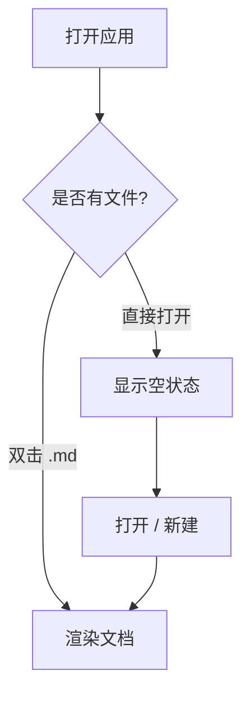
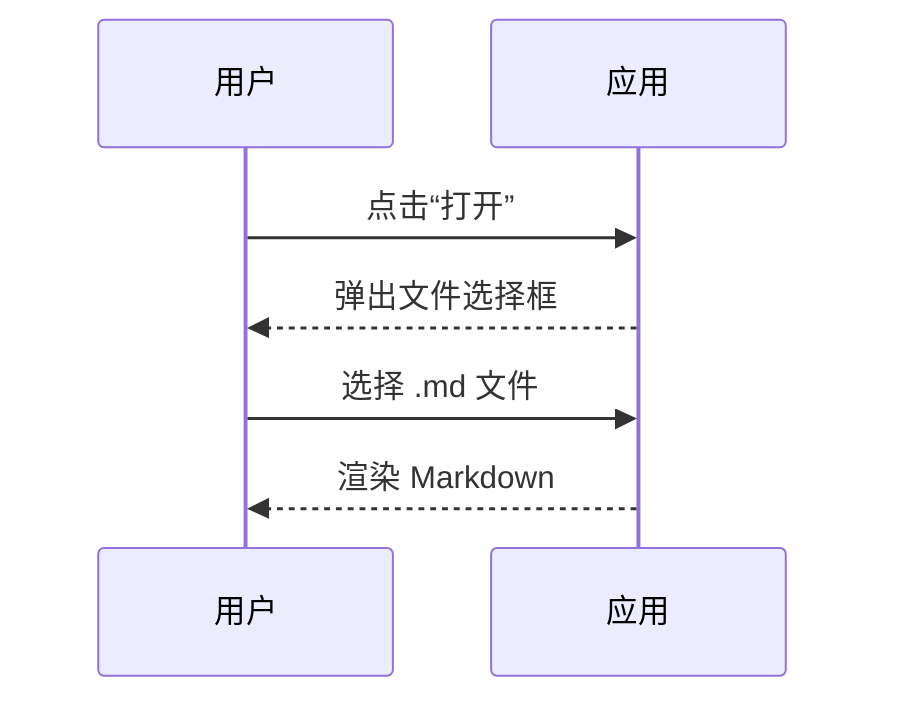
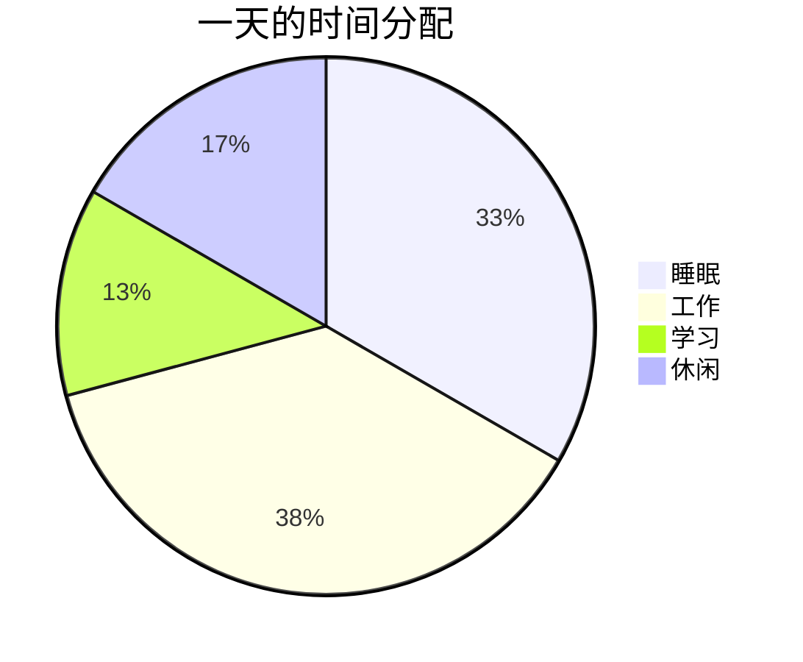
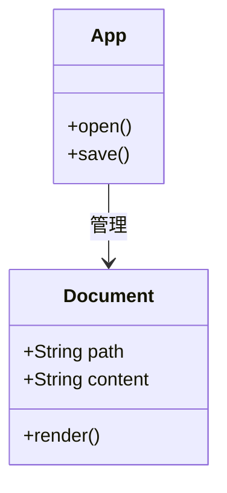

# Markdown 格式示例111

> 本文件汇总了常用的 Markdown 写法，并演示了 **公式（KaTeX）** 与 **图表（Mermaid）** 的渲染效果。
> 用 JamMarkdown 打开本文件即可看到渲染结果。

---

## 1. 标题

# 一级标题
## 二级标题
### 三级标题
#### 四级标题
##### 五级标题
###### 六级标题

---

## 2. 文本样式

这是一段**加粗**、*斜体*、***加粗斜体***、~~删除线~~以及`行内代码`的示范。

换行也可以在句末加两个空格  
来实现软换行。

---

## 3. 引用

> 引用可以嵌套。
>
> > 这是第二层引用。
>
> 引用中也可以使用 **加粗** 与 `代码`。

---

## 4. 列表

### 无序列表

- 苹果
- 香蕉
  - 进口香蕉
  - 本地香蕉
- 橙子

### 有序列表

1. 第一步
2. 第二步
3. 第三步

### 任务列表

- [x] 完成需求评审
- [x] 编写原型
- [ ] 交付开发
- [ ] 上线验收

---

## 5. 链接与图片

- 普通链接：[Tauri 官网](https://tauri.app)
- 带标题的链接：[MDN](https://developer.mozilla.org "前端文档")
- 参考文献式：[参考 1][ref1]


[ref1]: https://example.com "参考文献一"

---

## 6. 分割线

上面是链接，下面是一条分割线。

---

## 7. 表格

| 功能       | 快捷键        | 说明               |
| ---------- | ------------- | ------------------ |
| 保存       | Ctrl / Cmd+S  | 保存到当前文件     |
| 打开       | Ctrl / Cmd+O  | 打开 `.md` 文件    |
| 切换源码   | 右下角按钮    | 渲染 / 源码切换    |

---

## 8. 代码块（语法高亮）

```javascript
// JavaScript
const greet = (name) => `你好，${name}！`;
console.log(greet("JamMarkdown"));
```

```python
# Python
def fib(n: int) -> int:
    a, b = 0, 1
    for _ in range(n):
        a, b = b, a + b
    return a
```

```rust
// Rust
fn main() {
    let nums = vec![1, 2, 3];
    let sum: i32 = nums.iter().sum();
    println!("sum = {}", sum);
}
```

```bash
# Shell
npm install
npm run build
```

```json
{
  "name": "jam_md_view",
  "version": "0.1.0",
  "private": true
}
```

---

## 9. 公式（KaTeX）

### 行内公式

质能方程 $E = mc^2$ 是物理学中最著名的公式之一；欧拉恒等式 $e^{i\pi} + 1 = 0$ 则被誉为最美的数学公式。

### 块级公式

$$
\int_{-\infty}^{\infty} e^{-x^2}\,dx = \sqrt{\pi}
$$

$$
\frac{\partial}{\partial t} f(x,t) = \alpha \nabla^2 f(x,t)
$$

### 矩阵与求和

$$
\sum_{i=1}^{n} i = \frac{n(n+1)}{2}, \qquad
\begin{bmatrix} a & b \\ c & d \end{bmatrix}
\begin{bmatrix} x \\ y \end{bmatrix}
=
\begin{bmatrix} ax+by \\ cx+dy \end{bmatrix}
$$

---

## 10. 图表（Mermaid）

### 流程图



### 时序图



### 饼图



### 甘特图


### 类图



---

## 11. 结语

以上涵盖了标题、文本样式、引用、列表、链接、表格、代码高亮、公式与图表的常见写法。

祝书写愉快。 ✦
